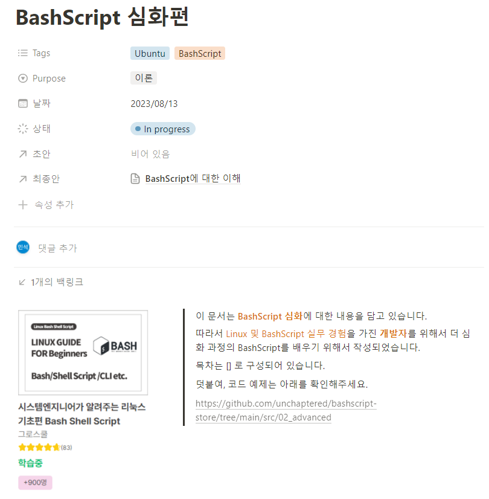

# Basic BashScript

This folder is created for [Chatper 4, Simple Bash Script in 'BashScript Basic Docs'](https://www.notion.so/unchaptered/BashScript-23787fc18b28445eba8010eb9f2e3516?pvs=4).

Following this lecture repository [VWS Vagrant Script](https://github.com/bashbomb/VWS_vagrant_script).

